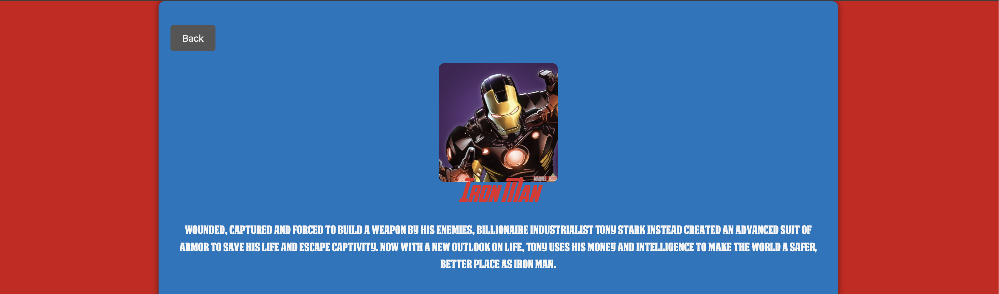
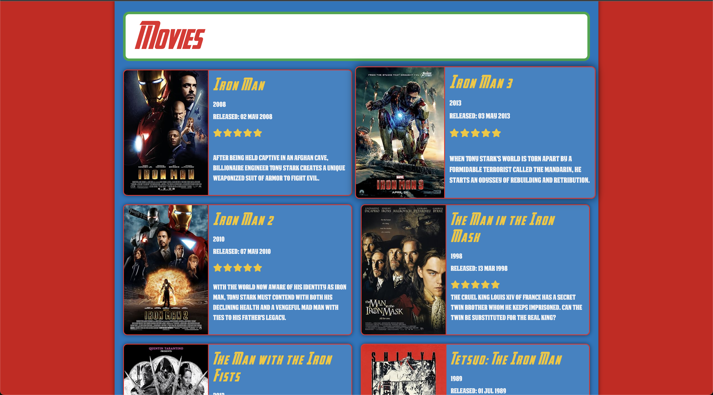

# Marvel Character Cinematic Guide

## Project Description

The Marvel Character Cinematic Guide is designed to help users discover and learn about Marvel characters and their movie appearances. Users can search for characters, view detailed information, see which movies they appear in, and save their favorites for quick access.

## Features

1. **Character Search**:
   - Users can search for Marvel characters.
   - Display detailed information about the character, including their description, comics they appear in, and related series.

2. **Movie Appearances**:
   - For each character, list the movies they appear in.
   - Fetch movie details (title, release year, plot, poster) using the OMDb API.

3. **Favorites**:
   - Allow users to favorite characters and movies for quick access.
   - Store favorites locally in the browser or using a simple backend.

4. **Random Character/Movie**:
   - Provide a feature to show a random Marvel character and their movie appearances.

## Technologies Used

- **Styling**:
  - Bootstrap for styling

- **Backend**:
  - Node.js
  - Express
  - Pug for templating
  - Axios for API requests

## APIs and Open Data Sources

1. **Marvel API**
   - **URL**: [Marvel API Documentation](https://developer.marvel.com/docs)
   - **Purpose**: To fetch information about Marvel characters, including descriptions, comics, and related series.

2. **OMDb API**
   - **URL**: [OMDb API Documentation](http://www.omdbapi.com/)
   - **Purpose**: To fetch movie details such as titles, release years, plots, and posters where Marvel characters appear.

## Wireframes

### Home Page
- **Search Bar**: Allows users to search for Marvel characters.
- **Introduction**: Brief overview of the tool.

### Character Details Page
- **Character Information**: Displays name, description, and comics.
- **Movie Appearances**: Lists movies the character appears in, with details.

### Favorites Page
- **Favorited Characters and Movies**: Displays a list of user favorited items.

## Installation

1. Clone the repository:

   ```sh
   git clone https://github.com/yourusername/marvel-character-cinematic-guide.git
   cd marvel-character-cinematic-guide
   ```

2. Install dependencies:

   ```sh
   npm install
   ```

3. Create a `.env` file in the root directory and add your API keys:

   ```
   MARVEL_PUBLIC_KEY=your_marvel_public_key
   MARVEL_PRIVATE_KEY=your_marvel_private_key
   OMDB_API_KEY=your_omdb_api_key
   ```

4. Start the server:

   ```sh
   npm start
   ```

5. Open http://localhost:3000 in your browser.

6. You should see the home page.

# Outputs

## Home Page


## Loader


## Character Details Page


## Character Movies Page


